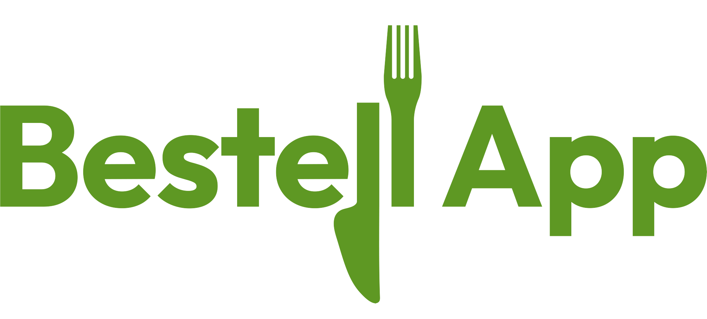
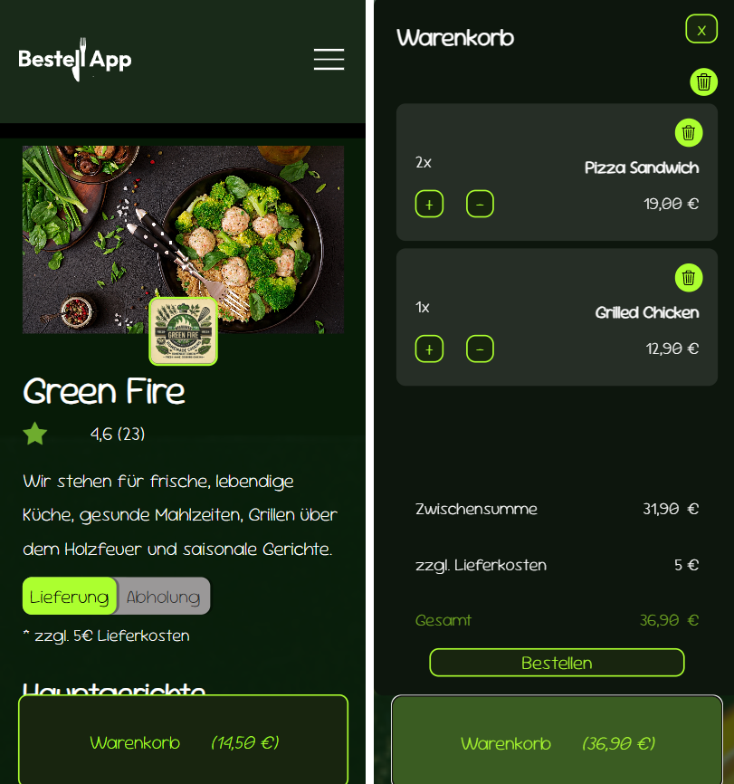
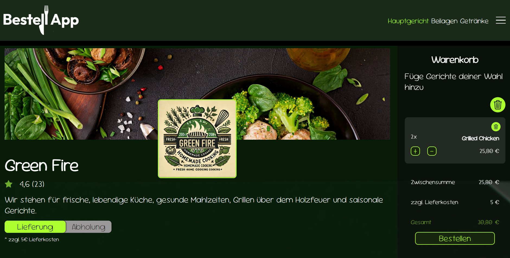

# 🥙 BestellApp - Order, Pick-Up & Delivery

This project is a rebuild of my existing BestellApp landingpage. I am currently working on a full-stack application with React Vite for the frontend, GSAP-powered animations, and Django for the backend API.  
BestellApp is a food ordering application that allows users to browse menus, place orders and choose between delivery or pick-up options.

## Demo

Live demo: [Coming soon](https://michelle-bit-web.github.io/bestell-app)

## 🪄 Features

📋 Browse Menus – View detailed menus with descriptions, prices, and images.

🛒 Easy Ordering – Add food and drinks to your cart with a single tap.

🚗 Delivery or Pick-Up – Choose between home delivery or pick-up at the restaurant.

📨 Order – Order your food and you will get an automatic reply. A payment method will be included.

🗑️ Delete - Delete single menus from the cart or the whole cart.

🔎 Navbar - Use the menu navigation bar to directly switch to a another dishes section.

👤 Login - Create an user account and login to see your order historiy.

🧠 Storage - The backend will ensure that the user´s recent actions are retained, even after refreshing or reopening the app. 

## 📸 Screenshots

Mobile preview:

Desktop preview:

## ⚙️ Technologies Used

- HTML
- CSS
- TypeScript
- React and Vite
- GSAP
- Django (Python)

## 🫳 How to Use

- clone this repository and open it to your browser
- no installations required

## 🤝 Contributing

Ideas and feedback are welcome! Feel free to open issues or submit pull requests.